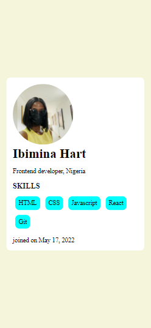
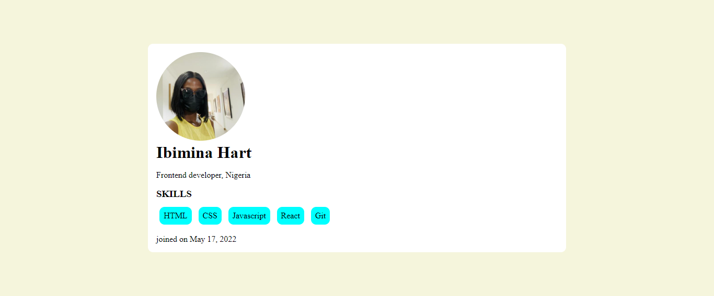

## Table of contents

- [Overview](#overview)
  - [The challenge](#the-challenge)
  - [Screenshot](#screenshot)
  - [Links](#links)
- [My process](#my-process)
  - [Built with](#built-with)
  - [What I learned](#what-i-learned)
- [Author](#author)


## Overview

### The challenge

Create a  profile card using  React functional component
### Screenshot





### Links

- Solution URL: (https://github.com/ibimina/day-one-exer-two)
- Live Site URL:(https://ibimina.github.io/day-one-exer-two/)

## My process
- import react from React
- import reactdom from react-dom/client
- import css and the image to be used for the project
- created variable to store some value
- created functional component for the header, main and footer
- created an App component to wrapper the hheadre, main and footer component

```jsx
const App = () => (
  <div className="app">
    <Header />
    <Main />
    <Footer/>
  </div>
);
```
- renedered the app component in the DOM

### Built with

- JSX
- CSS custom properties
- Flexbox
- Mobile-first workflow


### What I learned

I learnt how to use react functional component to  to design the following user card.
-
```jsx
const Header = () => (
  <header>
    
    <h1>
      {" "}
      {author.firstName} {author.lastName}
    </h1>
    <p className="title">Frontend developer, Nigeria</p>
  </header>
)
```


## Author

- Ibimina Hart
- Twitter -(https://www.twitter.com/ibiminaaH)
